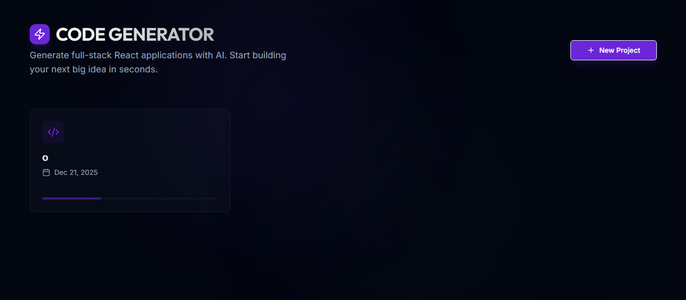
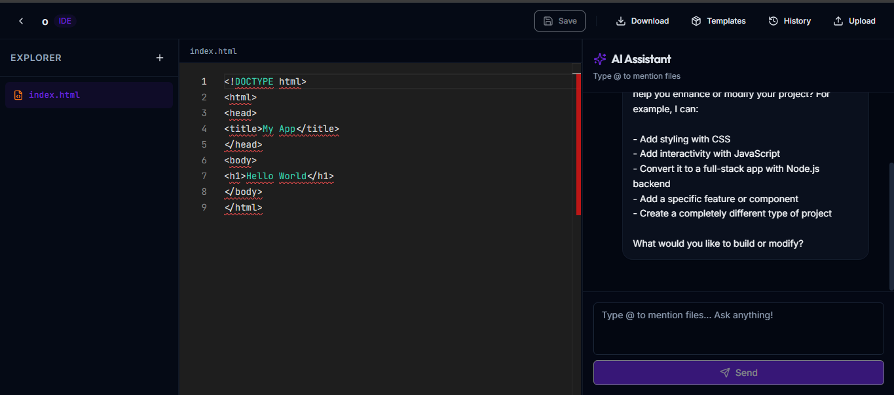

# AI Code Generator Platform

An intelligent full-stack web application that generates, manages, and edits code using AI. Built with React, Express.js, TypeScript, and Replicate API.

## Features

- **AI-Powered Code Generation**: Use natural language prompts to generate and modify code
- **Multi-Language Support**: Create projects in HTML, CSS, JavaScript, TypeScript, Python, Node.js and more
- **Live Code Editor**: Monaco Editor with syntax highlighting and code completion
- **File Management**: Create, edit, delete, and organize project files
- **Project Templates**: Pre-built templates for quick project initialization
- **File Uploads**: Upload and manage project assets
- **Version History**: Track file changes with version history
- **Drag & Drop**: Easy file and asset management with drag-and-drop support
- **Real-Time Preview**: See your changes in real-time

## Tech Stack

### Frontend
- **React 18** with TypeScript
- **Vite** for fast development and building
- **Tailwind CSS** for styling
- **shadcn/ui** component library
- **Monaco Editor** for code editing
- **React Resizable Panels** for layout management
- **TanStack React Query** for data fetching
- **Wouter** for routing

### Backend
- **Express.js** with TypeScript
- **PostgreSQL** (Neon serverless) for data persistence
- **Drizzle ORM** for database operations
- **Replicate API** for Claude AI model access

## Installation

### Prerequisites
- Node.js 18+
- npm or yarn
- PostgreSQL database (or Neon serverless)

### Setup

1. **Clone the repository**
   ```bash
   git clone https://github.com/sheikhtamimlover/Personal_CodingAI.git
   cd Personal_CodingAI

   ```

2. **Install dependencies**
   ```bash
   npm install
   ```

3. **Configure environment variables**
   - Create a `.env` file in the root directory with:
   ```
   DATABASE_URL=your_postgres_connection_string
   ```

4. **Configure API token**
   - Update `config.json` with your Replicate API token:
   ```json
   {
     "replicate": {
       "apiToken": "your_replicate_api_token"
     },
     "server": {
       "port": 5000,
       "host": "0.0.0.0"
     }
   }
   ```

5. **Initialize database**
   ```bash
   npm run db:push
   ```

6. **Start the development server**
   ```bash
   npm run dev
   ```

The application will start at `http://localhost:5000`

## Usage

### Creating a New Project
1. Click "New Project" on the home page
2. Enter a project name and select a template (optional)
3. Start building your project

### Generating Code with AI
1. Open a project
2. Type your request in the chat panel
3. The AI will generate or modify code based on your prompt
4. Review changes and apply them

### Managing Files
- **Create File**: Use the file explorer to add new files
- **Edit File**: Click on any file in the explorer to edit it
- **Delete File**: Right-click on a file and select delete (or use the delete button)
- **Download Project**: Download all project files as JSON

### Using Templates
- Browse available templates when creating a project
- Templates provide starter code for common project types

## Project Structure

```
.
├── client/              # React frontend
│   └── src/
│       ├── pages/       # Page components
│       ├── components/  # Reusable UI components
│       ├── lib/         # Utilities and helpers
│       └── App.tsx      # Main app component
├── server/              # Express backend
│   ├── routes.ts        # API route handlers
│   ├── storage.ts       # Database abstraction layer
│   └── db.ts            # Database connection
├── shared/              # Shared types and schemas
│   ├── schema.ts        # Data models
│   └── routes.ts        # API endpoint definitions
├── config.json          # Configuration file
└── package.json         # Dependencies
```

## API Endpoints

### Projects
- `GET /api/projects` - List all projects
- `POST /api/projects` - Create a new project
- `GET /api/projects/:id` - Get project details
- `DELETE /api/projects/:id` - Delete a project

### Files
- `POST /api/projects/:projectId/files` - Create a file
- `PUT /api/files/:id` - Update file content
- `DELETE /api/files/:id` - Delete a file
- `GET /api/files/:fileId/versions` - Get file version history

### Chat/AI
- `POST /api/projects/:projectId/chat` - Send chat message for AI code generation

### Templates
- `GET /api/templates` - List available templates
- `POST /api/templates` - Create a new template
- `DELETE /api/templates/:id` - Delete a template
- `POST /api/projects/:projectId/use-template/:templateId` - Use a template

### Uploads
- `POST /api/projects/:projectId/uploads` - Upload a file
- `GET /api/projects/:projectId/uploads` - List uploads
- `DELETE /api/uploads/:id` - Delete an upload

## Configuration

The application uses `config.json` for configuration:

```json
{
  "replicate": {
    "apiToken": "your_api_token_here"
  },
  "server": {
    "port": 5000,
    "host": "0.0.0.0"
  }
}
```

**Important**: Never commit `config.json` with your API token to version control. Use environment variables in production.

## Environment Variables

- `DATABASE_URL` - PostgreSQL connection string (required)
- `VITE_API_URL` - Frontend API base URL (defaults to /)

## Contributing

Contributions are welcome! Please follow these guidelines:
1. Create a feature branch from `main`
2. Make your changes with clear commit messages
3. Submit a pull request with a description of your changes

## Support & Contact

For questions, issues, or project inquiries:

**Author**: Sheikh Tamim  
**Instagram**: [@sheikh.tamim_lover](https://instagram.com/sheikh.tamim_lover)  
**Email**: tamimsheikh142@gmail.com  
**Website**: Available upon request

Feel free to reach out for:
- Bug reports and feature requests
- Project collaboration opportunities
- Technical consulting and custom development

## License

MIT License - feel free to use this project for personal and commercial purposes.

## Acknowledgments

- Replicate API for Claude AI model access
- shadcn/ui for beautiful UI components
- All open-source contributors and libraries that made this project possible

---

Built with for developers, by developers. Happy coding!
